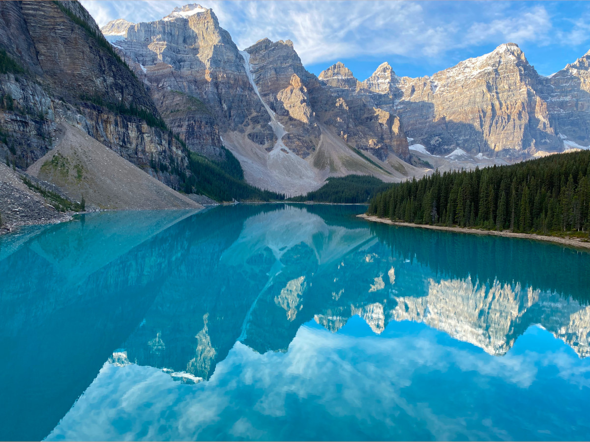
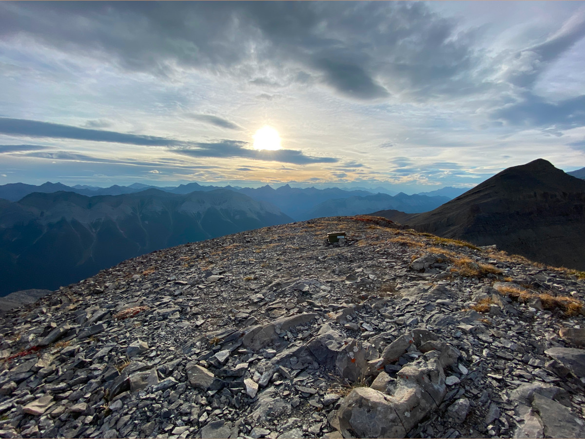
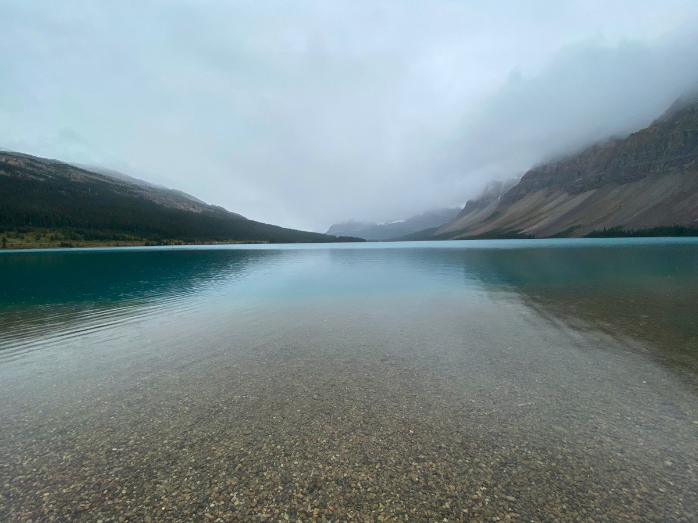
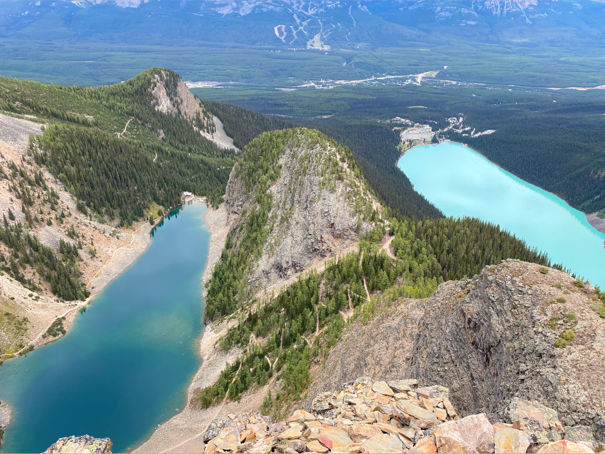
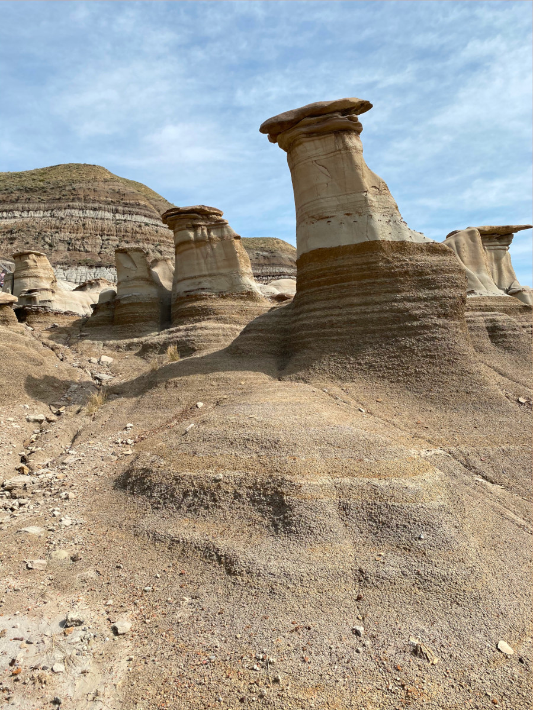

## My first travel experience!
In the Summer of 2021, I had my first travel experience... I went to Alberta for 7 days with a group of friends and absolutely loved it. It was the perfect choice for my first trip. Since Alberta is located in Canada, I didn't have to worry about foreign currency, sim cards, or language barriers (or COVID-19 as well). The flights were cheap and I LOVE hiking so everything lined up nicely.

## What we did
### Day 1
- Land in Edmonton
- Grocery shopping & preparations for the next few days
- Explore the city
### Day 2
- Wake up early, drive down to Jasper
- Explore Jasper! We did the Sulphur Skyline Trail
- Weather was bad, so we stayed in a nearby hostel for the night rather than camp
### Day 3
- Drive down to Banff (via Icefields Parkway), stop at:
    - Maligne Canyon
    - Horseshoe Lake
    - Athabasca Falls
    - Athabasca Glacier
    - Columbia Icefield Skywalk
    - Bow Lake
    - Wanted to visit Peyto Lake but it was closed :(
- Arrive in Banff, set up camp
### Day 4
- Lake Louise Teahouse Hike
- Big Beehive Hike
- Devil's Thumb Hike
- Camp (frontcountry) overnight
### Day 5
- Sunrise at Moraine Lake (fail)
- Banff Gondola
- Hike to backcountry campground (Lake Minnewanka)
- Set up camp
### Day 6
- Pack up camp, hike back
- East End of Rundle Hike
- Drive to Calgary
- Stay in AirBnB
### Day 7
- Day trip to Drumheller
- Drive back to Edmonton
- Stay the night in a friend's apartment
### Day 8
- Wake up and leave for the airport

## Highlights
My favourite part of the trip by far was visiting Moraine Lake and hiking up Mount Rundle.

The rich blue lake water surrounded by rugged peaks 3000m+ in height was nothing I'd ever seen before. In terms of beauty, Moraine Lake takes the top spot.

Hiking up East End of Rundle was a crazy experience. I started my hike late, so by the time I reached the summit, everyone had already left. There's something special about having an entire view to yourself - peace & quiet, no one to disturb you, it's just you and the beautiful view. Although the hike is short (~4.8km), it was steep and there was a lot of scramble which made it fairly challenging.

**Here are some other highlights:**
- THE NATURE... the mountains, waterfalls, lakes, animals, everything was a highlight for me
- Seeing mountain goats on our hike to our backcountry campsite
- Taking a dip in Lake Minnewanka on our way back from the backcountry campsite
- Meeting "Ivan the African", a man born and raised in Africa, at our backcountry campsite... I really enjoyed hearing his travel stories
- Stargazing on the shore of Lake Minnewanka and watching the sun rise the next morning
- Making friends with a solo traveller in our hostel in Jasper
- Ordering food from "Peter's Drive-In" in Calgary
- Seeing the Hoodoos in Drumheller

*Quick stop at Bow Lake on our way to Banff.*

*The view from the top of Devil's Thumb. You can see Lake Louise and Lake Agnes from here.*  

*Some Hoodoos in Drumheller...*  

## Lessons that I learned...
It's funning reading these over because they all seem so obvious 😆.

1. Consider the weather forecast before going on a hike LOL. We did the Sulphur Skyline Trail when it was cold and raining... not fun. I was wet and freezing by the time I reached the summit. There wasn't even a view either because of all the clouds. If you considered the weather and decide to proceed, ensure you have proper hiking equipment.
2. If you want to see the sunrise at Moraine Lake, GET THERE EARLY. When we tried going in the morning (this was in late August), we couldn't enter the parking lot because it was full. The worker told us that people camp overnight (or arrive during the night) just to see the sunrise at Moraine Lake.
3. The Banff Gondola was a little underwhelming... It was only 5 minutes long and crowded at the top. I'm glad I got the experience but would much rather prefer a hike!
4. Bring a headlamp on your hike... I left just before sunset and thought I'd make it down Rundle before it got completely dark, but I ended up getting lost. Towards the end of my way back, it was pitch black.
5. Don't be afraid to spend money. I tried to be as frugal as possible during my trip but then at a restaurant, I thought to myself: "I've never had fresh bison from Alberta before..." and just ordered it despite it being expensive. Gaining new and unique experiences is worth the cost (within reason)!
6. I made a **rough** budget for my trip but ended up leaving out a TON of expenses, such as spontaneous activities, emergency expenses, some entertainment costs, and souvenirs. I also heavily underestimated the cost of food. Next time, I should be more realistic with my budget while also allocating the aforementioned expenses. However, I'll ensure not to over plan or I'll miss out on spontaneous experiences.
7. We did not know how to backcountry camp 🤣. We did not bring enough food or the right supplies, nor did we have the skills. Luckily, there were other people at our campsite and we didn't stay long (1 night) - which was another mistake. We hiked 9km (or was it 11km? can't remember) to the campsite just to stay there for one night and thus missed out on so many experiences. Our "camping trip" was just another hike. Next time, I want to allocate more time for a true backcountry experience!

## Final notes
Overall, my first travel experience was awesome - I had so much fun and learned so much. I hope to visit Alberta again someday and already have some ideas on where I want to go 😄!