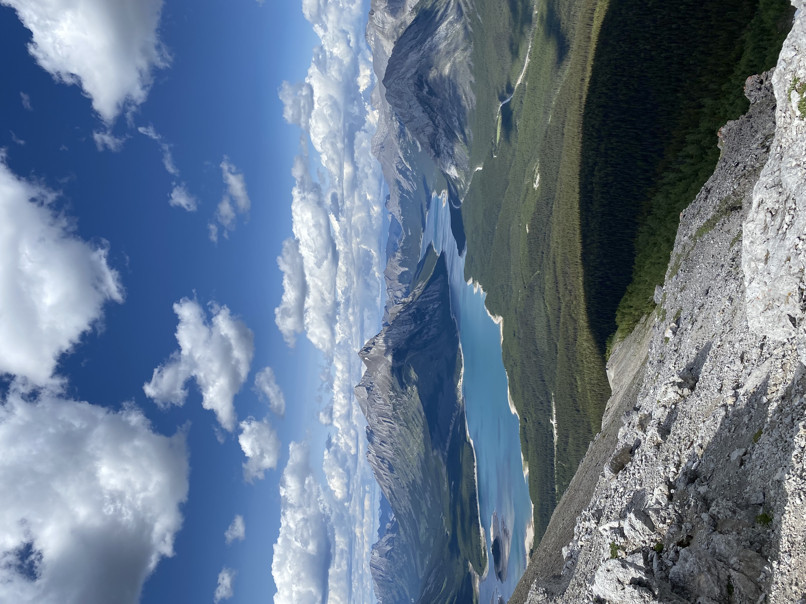

## Canada Day long weekend
With the Canada Day long weekend approaching, I made the spontaneous decision to take two days off work on top of the long weekend (5 days total) and booked a flight to Calgary. I decided to go back to Alberta because it was a quick (short flight), cost effective, and convenient option especially for a spontaneous trip during the middle of a co-op term! Shout out to my boss for letting this happen 😄.

## Spontaneity
I didn't have much planned for the trip because it was so last minute. I knew I was going to meet up with a friend on Friday night to go hiking with them the next few days, but other than that it was a "figure it out as you go" kind of trip.

## Hikes
During the five days I was in Alberta, I completed three hikes. The weather in the Rockies was amazing during my time there, and the three hikes I did by chance turned out to be really good.

### Hike 1 - Grotto Mountain with strangers I met at a hostel
- The most difficult & rewarding out of the three hikes
- It was a loop featuring great views, lots of scramble, and a ridge walk
- I recommend completing the loop counter-clockwise as it is more difficult/rewarding
- The hike is fairly steep the whole way through
- The tree line ends halfway to the peak, and the remaining path contains loose rock and scramble

### Hike 2 - Tent Ridge Horseshoe with my friend
- The best views out of the three hikes
- The ridge is shaped like a horeshoe and each point on the ridge gives a unique view so there is lots of variety!
- I recommend completing the loop clock-wise
- Hike starts off very easy in a forrested area. The ascent after the tree line contained some light scramble but nothing too difficult

### Hike 3 - Mount Yamnuska solo
- The most exciting of the three hikes
- The chain section, traverse, and scree slope descent were extremely fun
- The trail is very well marked and difficult to get lost on
- There was a lot of scramble. Some of the rocks were slippery due to high foot traffic over the past few decades

## What I learned...

1. Nutrition. I learned a lot about my body, it's limits, and the amount and type of nutrition it needs on hikes. I definitely could have done a better job with managing my nutrition. 
    - I did not bring enough food or water (+electrolytes) to Grotto Mountain, which made the hike more difficult than it should have been
    - I did not stock up on enough food at the grocery store prior to visiting Canmore

## Final notes
Overall, a very successful trip. Hiking the mountains was perfect way to spend the Canada Day long weekend!