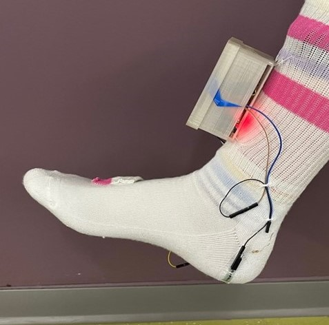
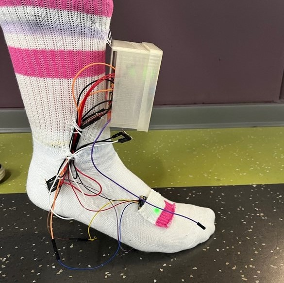
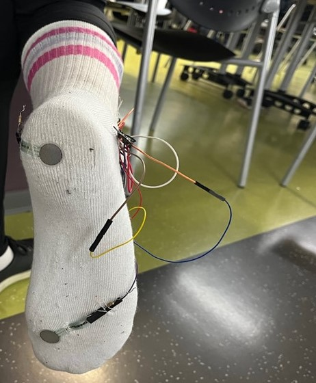
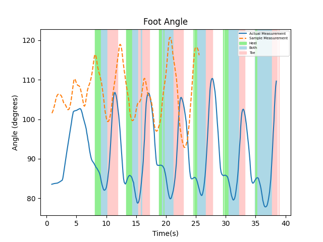

## The Project
### Description
A device intended to be operated by parents/guardians of children with cerebral palsy. The device measures the child's ankle joint angle during the gait cycle and outputs a graph for a clinician to analyze. The idea is to perform measurements periodically so the clinician can monitor changes in the child's gait over time. This device can be used to evaluate treatment outcomes.

### Components
- ESP32-PICO-D4
- 2x Adafruit BNO055
- 2x Force Sensitive Resistor

