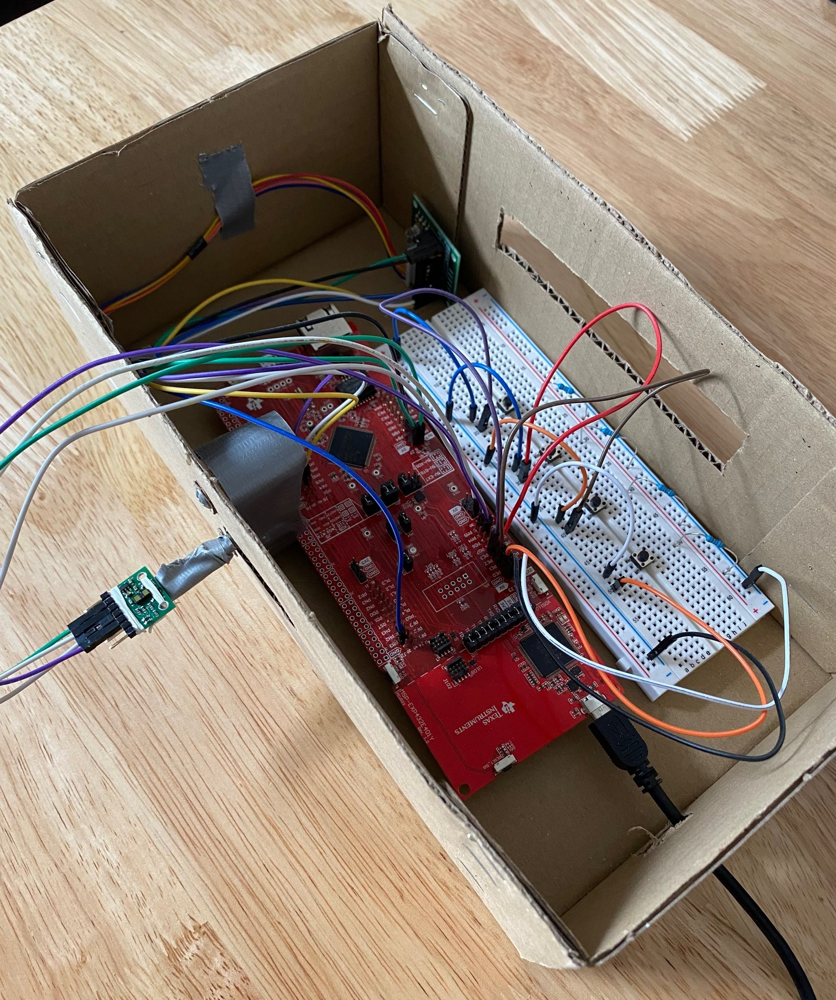
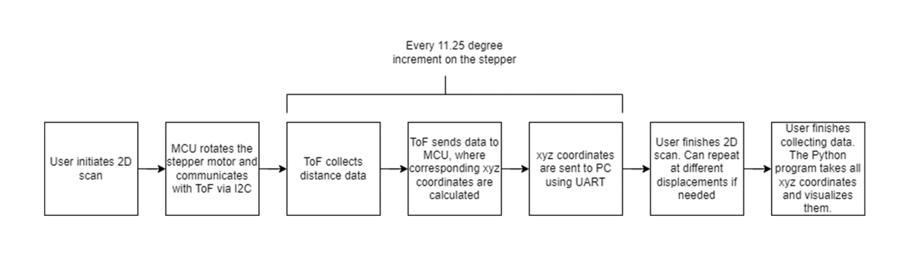
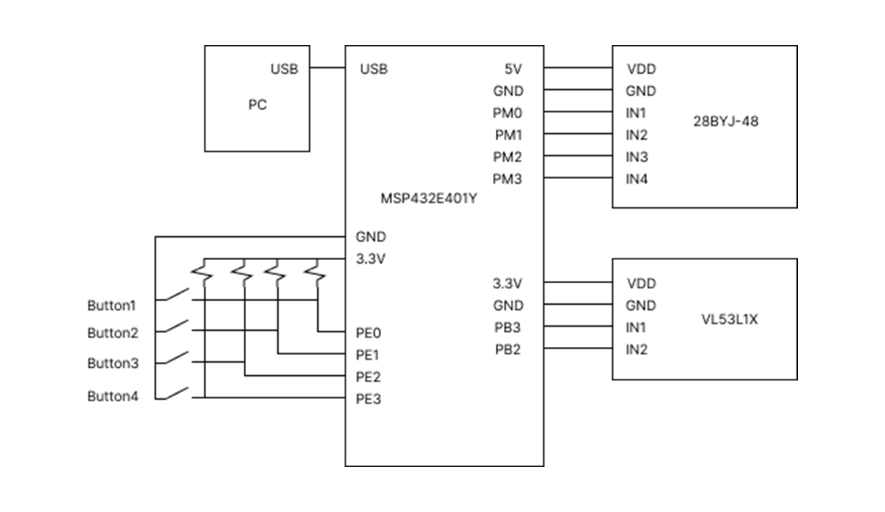
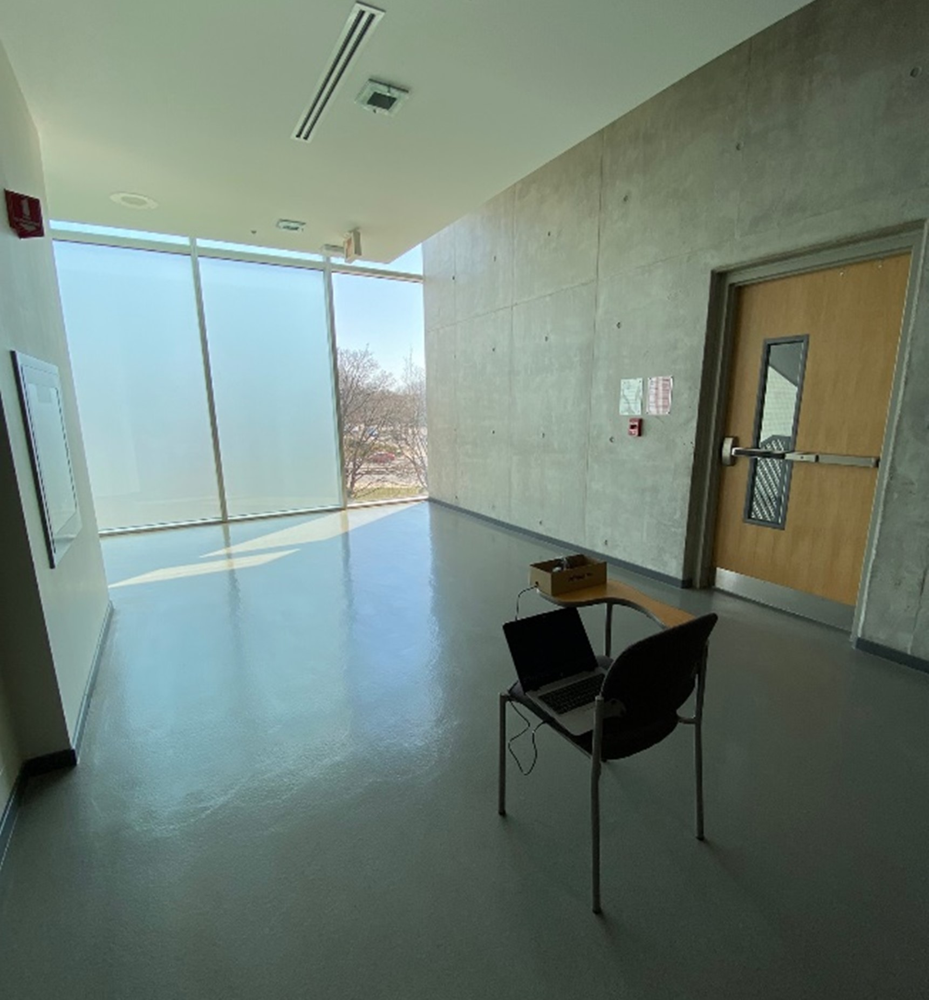
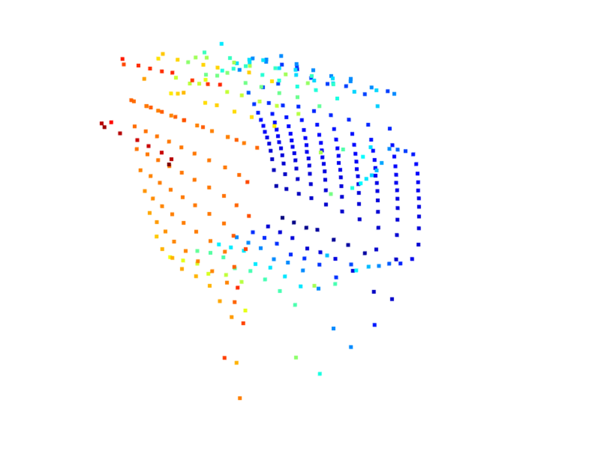
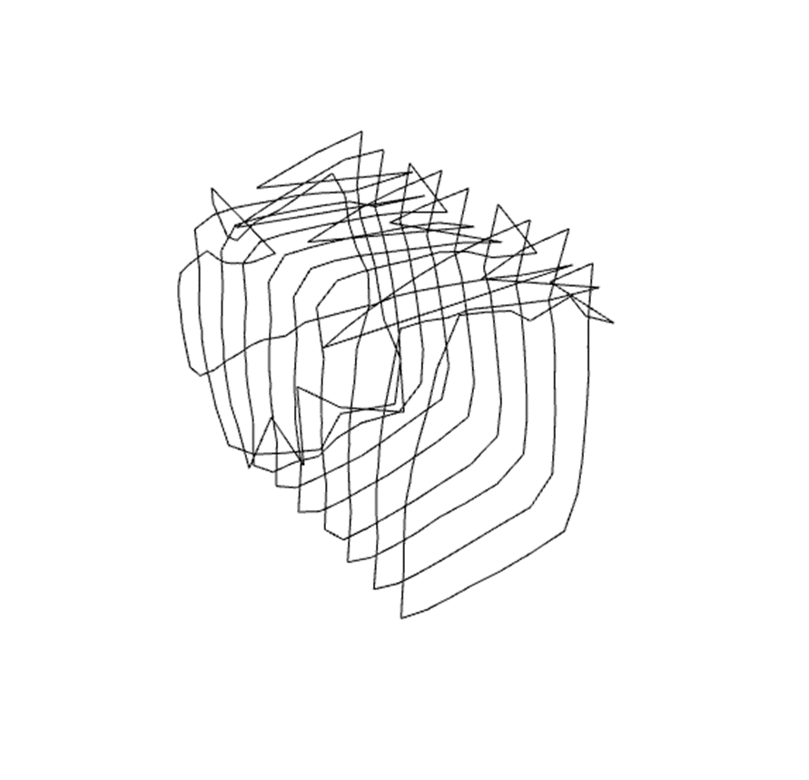

## Project Details
### Description
An embedded spatial measurement system powered by a MSP432E401Y microcontroller (MCU). It features a VL53L1X Time of Flight Sensor (ToF) mounted on a 28BYJ-48 stepper motor, which rotates counterclockwise to complete a 360º scan within a single vertical plane. The user can conduct multiple scans, moving ~60cm along the orthogonal axis in between scans, to create a 3D visualization of the room. After all scans are completed, a Python program on the user’s PC will provide a 3D visualization of the room using the Open3D library. The system has four buttons:

- Button 1: Starts and stops the entire data acquisition process
- Button 2: Starts and stops a single 2D scan (motor and ToF)
- Button 3: Signals to the MCU that the user will be completing another 2D scan ~60cm from the last one

The system is powered by a USB2.0 connection to a PC. It is compatible with any PC running Python version 3.7-9. 

### Rationale
Commercial LiDAR is expensive and bulky. Building a less complex, and less expensive system suitable for indoor mapping is a great opportunity to learn about how to collect, process, and communicate data in an embedded system 

### Data flow

### Circuit Schematic

### Example
Here is an example of the system scanning a hallway, and the resulting point cloud. To be honest, the result does not look great at all 🤣. A big reason for the inaccuracy was the wires connected to the ToF obstructing the measurement while also not allowing it to move freely.

