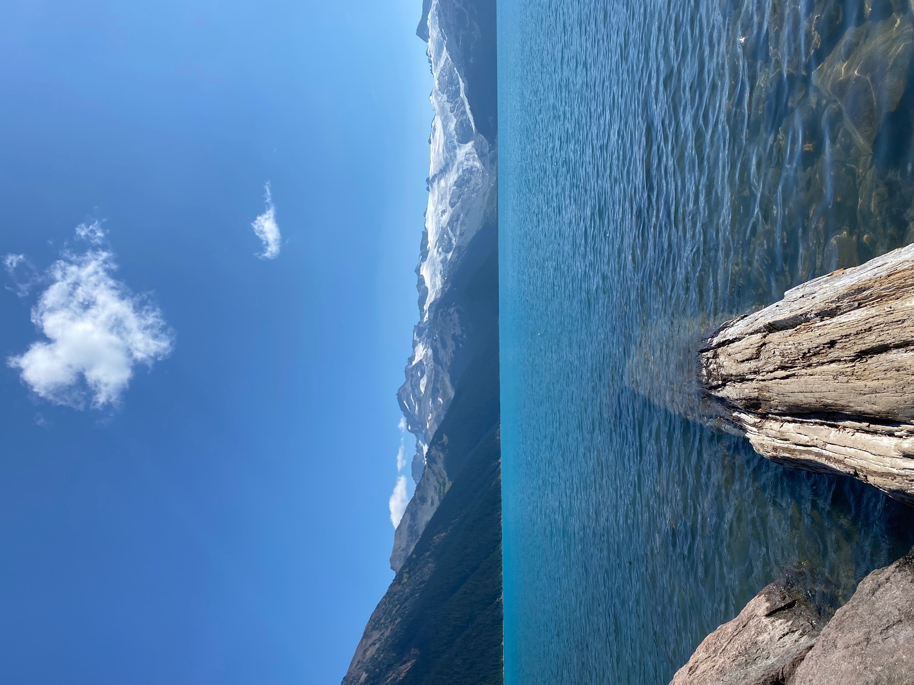
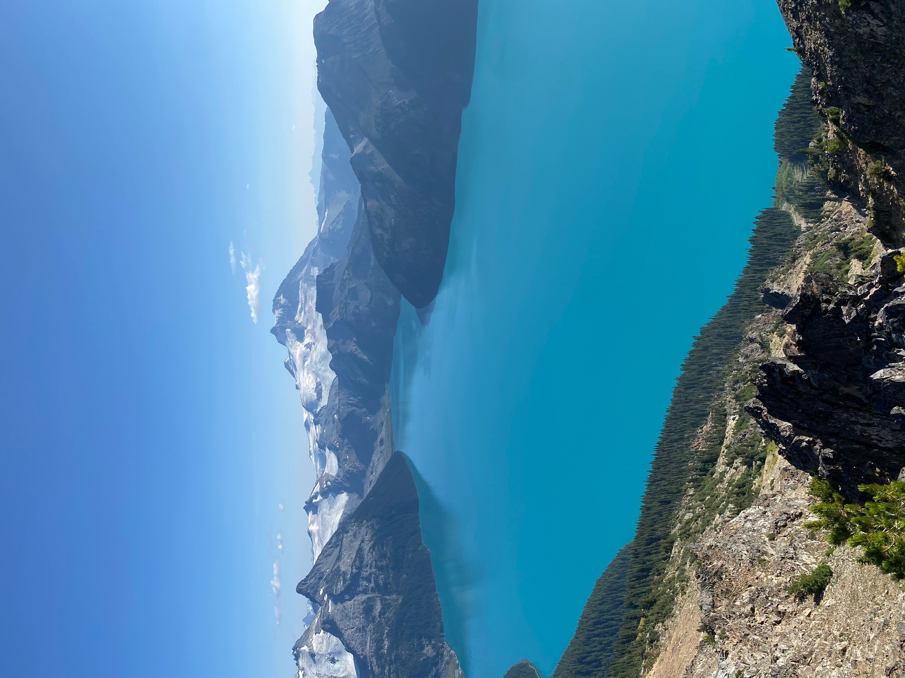
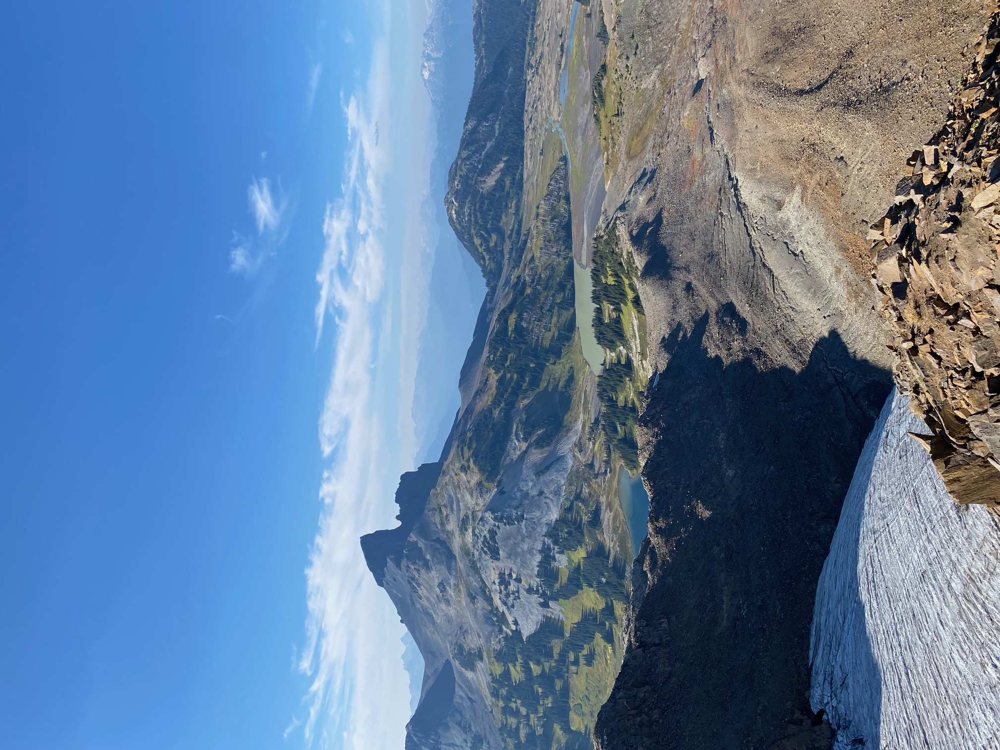
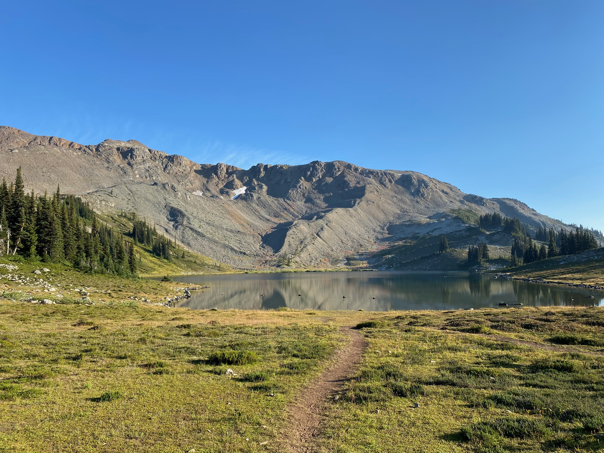
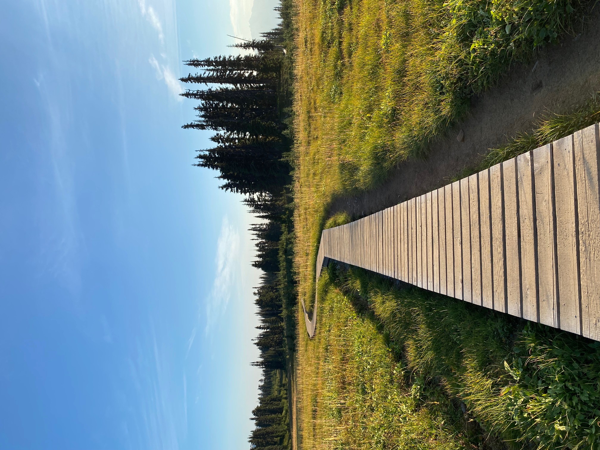

## A new medium for documenting travel
During my last three trips, I documented my experiences through a medium that was convenient, dynamic, and one that I felt captured its entirety... if that makes sense haha. Basically what I'm trying to say is, although I published a note on this site for every trip I completed up until now, I've also been documenting my trips in a personal (non-public) format. And this format is... well, way better than publishing a note like the one you're reading here.

After I finish a trip, I would publish a note containing details about my trip. However, for my three most recent trips, the process was so redundant because everything I wrote was already documented in a different format. I found my last travel note to be a chore to write just because I didn't see a purpose in writing it.

I initially started writing here because I wanted a central location to record and reflect on my travels for personal reasons, and I thought it would be cool to create a (lowkey) website so I could also share my experiences with others. My first post [My first trip - Alberta 2021](https://davidchung.me/notes/posts/alberta21/) is an example. But, now that I've found a better way to do that, I'll discontinue documenting my travel here. Rather than treating this page as a medium to document every trip, it'll be a place to share any notes I want to share with others - which could be travel related or not.

Anyways here are some photos from a hike I did near Vancouver!

