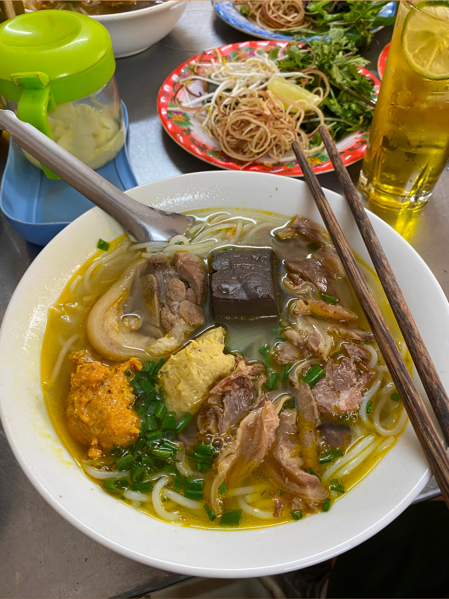
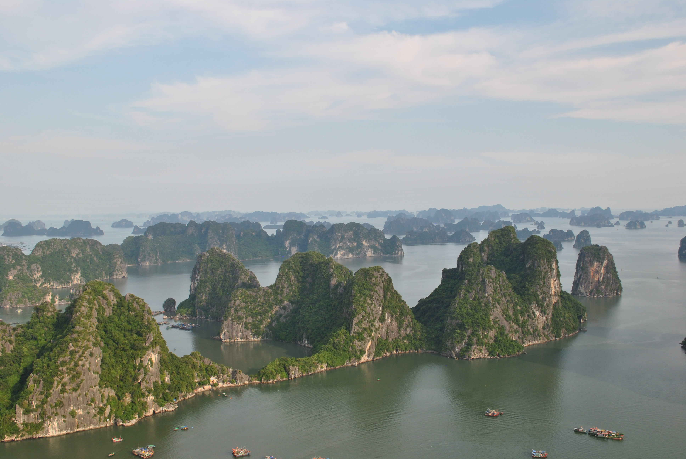
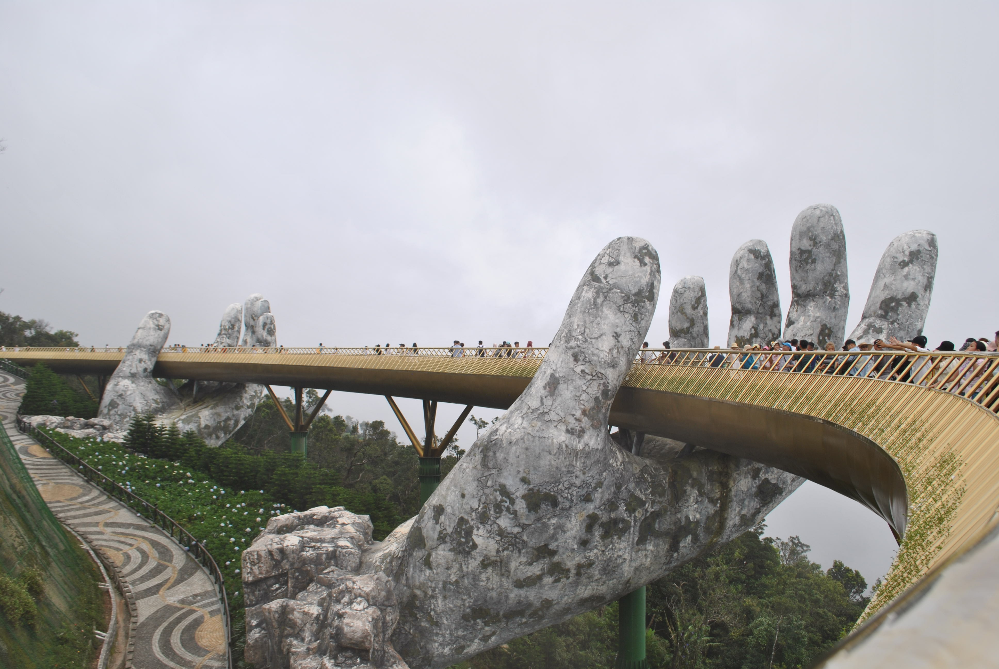
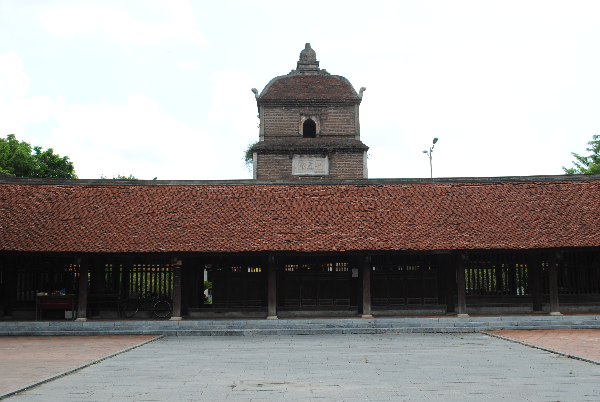
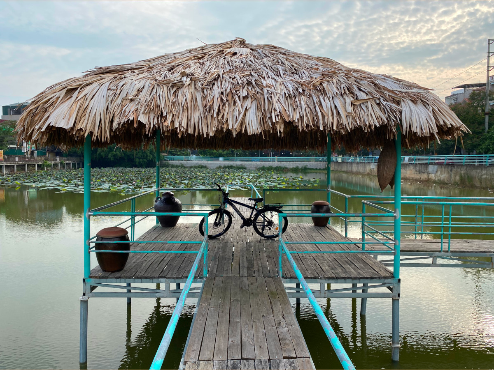

## The homeland
In the Summer of 2022, I finally travelled to Vietnam - the country my parents were born and raised in, and one that has been at the top of my bucket list forever. It was remarkable.

My entire extended family (mom's side) lives in Vietnam, and I essentially met them for the first time in my life. My aunts, uncles, cousins, and Grandma... finally meeting them was the biggest highlight of my trip. I went to Vietnam with my family, and we stayed in my uncle's house in Bac Ninh City (North) for 4 weeks. It was such a unique experience for me, and I am so grateful to have had the opportunity to visit.

## What we did
This trip was the first time my family and extended family were brought together in the same place. It's a rare occasion for my family to even go on vacation together, let alone visit my extended family in Vietnam! As much as I love adventure, I made it my priority to spend as much time with my family as possible while I had the chance. I will always have the opportunity to visit Vietnam another time (solo 👀) and explore the country... but I won't always have the opportunity to spend time with my entire family & extended family together. So what did I do on my trip? In short, **I came to Vietnam to live there for 4 weeks as a local.**

### My daily experiences and observations
Vietnam is very different from Canada. I had never been outside of Canada until now, so this experience was especially eye-opening.

- Vietnam is very hot and humid. I was told the lowest temperature they'll get in Bac Ninh is 15 degrees Celcius
- People wake up early here. I would see a lot of people at 5:30 am exercising or setting up shop for the day.
- Many people, such as myself, would nap around noon/afternoon (at least where I stayed). It was too hot to go outside.
- The population is very dense. I would see a lot of people on the streets and the houses are tall, narrow, and very close to each other.
- Many houses operate as shops (shophouses) - the first floor is used for the shop and family members sleep on the upper floors. 
- Almost all my breakfasts were eaten out. I could walk down the street to a shophouse and eat an entire meal for less than $5. This image shows "Bun Bo Hue", a Vietnamese Noodle Soup originating from Hue (a city in Central Vietnam), which cost me **$2.20 CAD**.

- There is a very strong sense of community here. Everyone in the neighbourhood knew each other. My aunts, uncles, and cousins would visit my Grandma every day. Grandparents live with their grandchildren and play an important role in their upbringing. In comparison, families in Canada seem more isolated.
- Traffic rules are not as strict compared to Canada.

### Travelling within Vietnam
Along with just living life in Vietnam, my extended family took us to some cool places, specifically:
1. Hanoi
2. Various temples and pagodas
2. Da Nang
    - Hoi An
    - Ba Na Hills
3. Tam Dao - a town in the mountains
4. Ha Long Bay (I went here by myself)

Overall, I enjoyed the family trips! The main downside was that these places are very touristy and therefore crowded. I also thought Tam Dao was disappointing... there weren't many great views or much to do, the town was very dirty and crowded, the food was expensive, and I found the air hard to breathe because of all the smoke. Personally, it wasn't my vibe. My favourite trip was to Ha Long Bay (the only trip I did myself), where I skipped the cruise and instead hiked up a mountain to get a stunning view of the bay.

*View of Ha Long Bay from the top of a mountain*

*Golden Bridge located on Ba Na Hills, Da Nang*

*Dau Pagoda - the oldest pagoda in Vietnam*

### Some more highlights
- The FRESH and DELICIOUS food
- Exploring Bac Ninh with my uncle's bicycle

- Meeting, chatting, and making friends with locals
- Playing pick-up basketball with some kids at a high school
- Kicking a shuttlecock with two guys I met at the park. They would come to the same park every morning!
- Getting a 1-hour massage for $5
- Getting a haircut for $2.50
- Swimming at the beaches in Da Nang
- Going on a bullet train for the first time

## Closing thoughts
That concludes my notes on my recent trip to Vietnam. Again, my priority for this trip was to spend time with my family. I will be coming back to Vietnam soon and have some really awesome adventures planned!